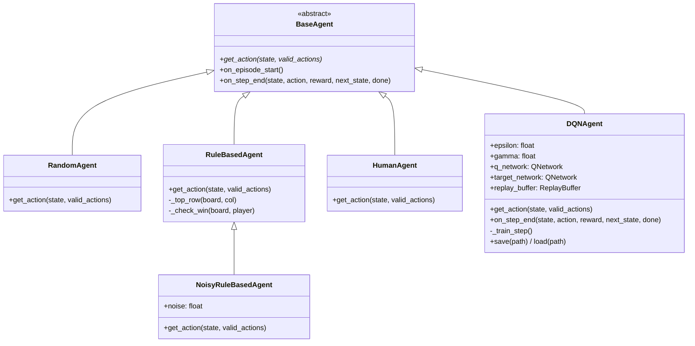
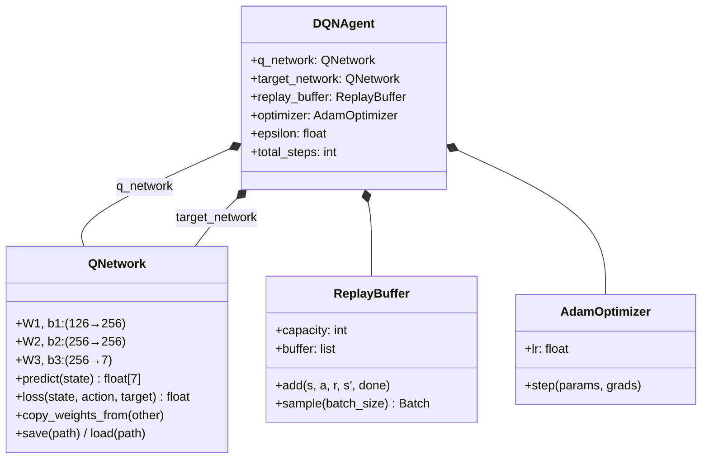
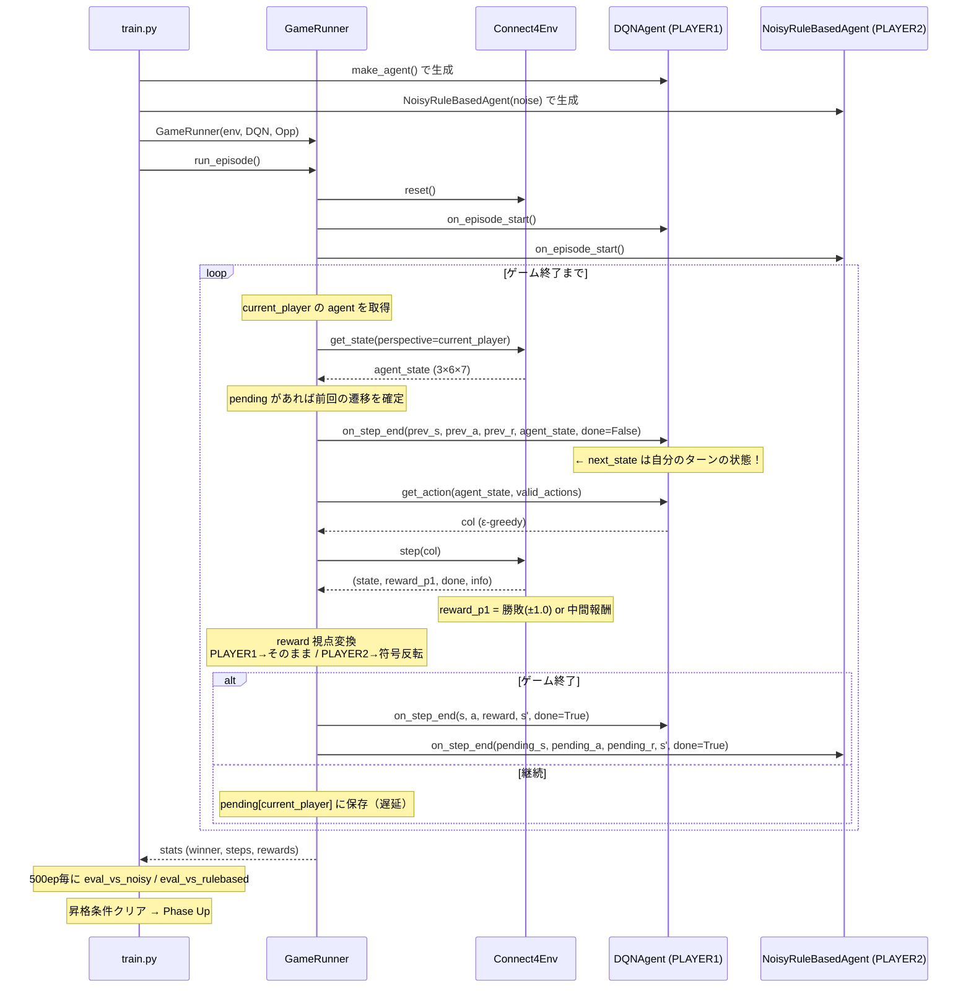
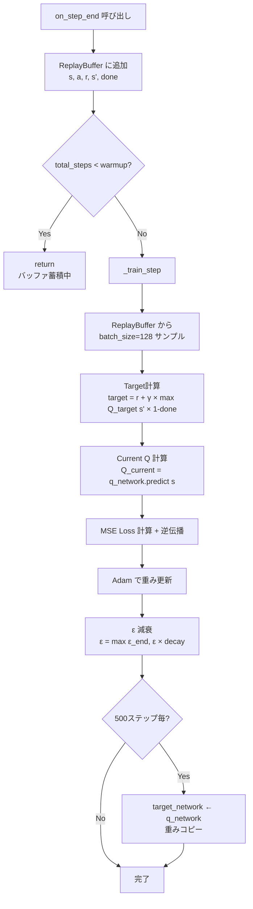
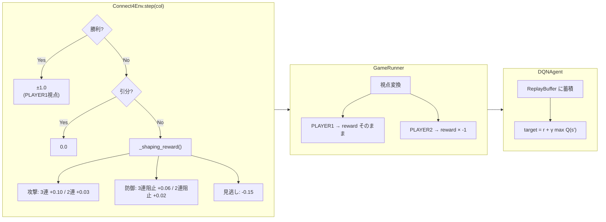
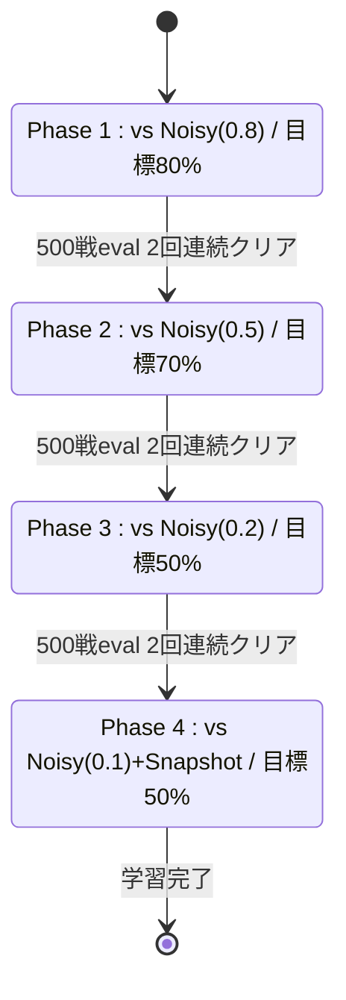
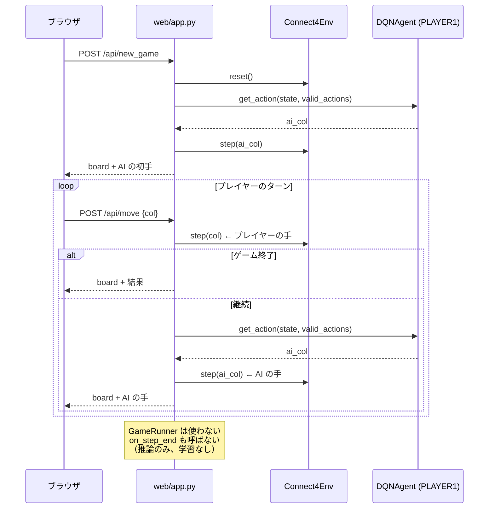
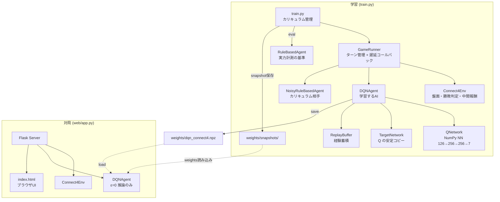

# Connect Four RL プロジェクト — アーキテクチャ図

## 1. クラス継承関係



## 2. DQNAgent 内部構造



## 3. 学習時のシーケンス（train.py → GameRunner → env/agents）



## 4. DQN学習ステップ（on_step_end 内部）



## 5. 報酬の流れ



## 6. カリキュラム学習フェーズ（train.py）



## 7. Web UI でのゲームプレイ（学習なし）



## 8. 全体の登場人物マップ



---

## 9. 登場人物カタログ — 各自の特性と関係性

強化学習の全体像を掴むため、各登場人物について **「自分は何者か」「周囲と何をやりとりするか」** を整理する。

---

### Connect4Env（環境）

**自分は何者か:**
ゲームのルールそのもの。6×7 の盤面を管理し、コマを落とし、勝敗を判定する。
強化学習の用語では **環境（Environment）** にあたる。
エージェントが「行動」を送ると、「次の状態」と「報酬」を返す ― これが強化学習の基本サイクルの片方。

**周囲との関係:**

| 相手 | やりとり | 方向 |
|---|---|---|
| GameRunner | `step(col)` を受け取り `(state, reward, done, info)` を返す | ←→ |
| GameRunner | `get_state(perspective)` で特定プレイヤー視点の盤面を提供 | → |
| GameRunner | `get_valid_actions()` で合法手リストを提供 | → |
| DQNAgent | **直接の接点はない**（GameRunner経由） | - |

**強化学習における役割:**
環境は「ゲームの物理法則」。エージェントの行動を受けて世界が1ステップ進み、その結果（報酬・次の状態）をフィードバックする。エージェントはこのフィードバックから学ぶ。

**設計上のポイント:**
- `step()` は **1人分の手** だけを処理する（相手は呼ばない）。これにより self-play やカリキュラム学習など、様々な対戦構成に対応できる。
- 報酬は常に **PLAYER1 視点** で返す。視点変換は GameRunner が行う。
- 中間報酬（`_shaping_reward`）もここで計算する。置いたマス起点で2連・3連を検出し、小さな報酬を返す。

---

### DQNAgent（学習するエージェント）

**自分は何者か:**
「どの列にコマを置くか」を決める頭脳。内部に **ニューラルネットワーク（QNetwork）** を持ち、盤面を入力すると各列の「良さ（Q値）」を出力する。
強化学習の用語では **エージェント（Agent）** にあたる。

**周囲との関係:**

| 相手 | やりとり | 方向 |
|---|---|---|
| GameRunner | `get_action(state, valid_actions)` で行動を返す | → |
| GameRunner | `on_step_end(s, a, r, s', done)` で経験を受け取る | ← |
| QNetwork（内部） | 盤面を渡し、7列分のQ値を受け取る | ←→ |
| TargetNetwork（内部） | 学習ターゲット計算に使う安定したQのコピー | ← |
| ReplayBuffer（内部） | 経験を蓄積し、ランダムに取り出して学習する | ←→ |
| Connect4Env | **直接の接点はない**（GameRunner経由） | - |
| 対戦相手 | **直接の接点はない**（環境を介して間接的に影響を受ける） | - |

**強化学習における役割:**
エージェントは「行動を選び、その結果から学ぶ」存在。以下の2つの仕事を交互に行う:

1. **行動選択（推論）**: 盤面 → QNetwork → Q値 → ε-greedy で列を選ぶ
2. **学習（訓練）**: 過去の経験からQ値の予測精度を上げる

**学習のメカニズム（ここが強化学習の核心）:**

```
経験 (s, a, r, s') を受け取ったら:

  「状態 s で行動 a を取ったとき、報酬 r を得て状態 s' になった」

  理想的には Q(s, a) = r + γ × max Q(s', a')  であるべき
                        ~~~   ~~~~~~~~~~~~~~~~~
                        即時報酬   将来の報酬の見積もり

  現在の Q(s, a) とこの理想値のズレ（誤差）を縮めるように
  ニューラルネットの重みを少しずつ調整する → これが「学習」
```

**ε-greedy とは:**
- 確率 ε でランダムな列を選ぶ（探索: 未知の手を試す）
- 確率 1-ε で Q値が最大の列を選ぶ（活用: 今の知識で最善を尽くす）
- ε は学習が進むにつれ 1.0 → 0.10 に減衰する（最初は探索重視、徐々に活用重視）

---

### QNetwork（ニューラルネットワーク）

**自分は何者か:**
DQNAgent の「脳」。盤面（126次元）を入力すると、7列それぞれの **Q値**（その列に置くことの良さ）を出力する。
NumPy で手書き実装した3層の全結合ネットワーク。

**構造:**
```
入力 (126) → Linear+ReLU (256) → Linear+ReLU (256) → 出力 (7)
```

**周囲との関係:**

| 相手 | やりとり | 方向 |
|---|---|---|
| DQNAgent | `predict(state)` でQ値を返す（推論時） | → |
| DQNAgent | `loss(state, action, target)` で誤差計算+逆伝播（学習時） | ←→ |
| TargetNetwork | 定期的に自分の重みをコピーされる | → |
| Adam | 逆伝播で得た勾配を使って重みを更新される | ← |

**強化学習における役割:**
Q値は「この状態でこの行動を取ると、最終的にどれくらいの累積報酬が得られるか」の予測値。
最初はランダムな重みなのでQ値はデタラメだが、大量の対局経験から少しずつ正確になる。
Q値が正確になれば、「Q値が一番高い列を選ぶ」だけで強い手が打てるようになる。

---

### TargetNetwork（ターゲットネットワーク）

**自分は何者か:**
QNetwork の「少し古いコピー」。500ステップごとに QNetwork の重みをコピーして更新される。

**なぜ必要か:**
DQN の学習では「理想のQ値」を計算するのに QNetwork 自身を使う:
```
target = r + γ × max Q(s', a')
                  ~~~~~~~~~~~~~~
                  ← これを計算するのに Q を使う
```
もし学習中の QNetwork 自身をここに使うと、**学習するたびにターゲットも動く**（追いかけっこ状態）。
TargetNetwork は一定期間固定されるため、ターゲットが安定し、学習が収束しやすくなる。

---

### ReplayBuffer（経験再生バッファ）

**自分は何者か:**
過去の経験 `(s, a, r, s', done)` を溜めておく記憶装置。最大50,000件を保持。

**なぜ必要か:**
- **時系列の相関を壊す**: 対局中の連続した経験は似ている。ランダムに取り出して学習することで、偏りを減らす。
- **効率的なデータ活用**: 1つの経験を何度も学習に使える。

---

### GameRunner（ゲーム進行管理）

**自分は何者か:**
環境とエージェントを繋ぐ **司会者**。ターンを管理し、各エージェントに順番に「行動して」「結果はこうだったよ」と伝える。
強化学習の理論には登場しないが、実装上はこれがないと学習ループが回らない。

**周囲との関係:**

| 相手 | やりとり | 方向 |
|---|---|---|
| Connect4Env | `step(col)` で盤面を進める、`get_state()` で状態取得 | ←→ |
| DQNAgent | `get_action()` で手を聞く、`on_step_end()` で経験を渡す | ←→ |
| 対戦相手 | 同上（ただし相手は on_step_end で学習しない） | ←→ |
| train.py | `run_episode()` を呼ばれ、対局結果を返す | ←→ |

**遅延コールバック方式（本プロジェクト固有の重要設計）:**

通常のゲームAIなら「自分が打った直後」に結果を渡せばよいが、DQNには問題がある:

```
普通にやると:
  DQNが列3に置く → env.step(3) → next_state は「相手のターンの盤面」

  問題: Q(s', a') は「自分のターンの盤面」で学習しているのに
        「相手のターンの盤面」を入力している → Q値の予測が信頼できない
```

**解決策:** 相手が1手打つまで待ってから、DQNに経験を渡す。

```
遅延コールバック:
  DQNが列3に置く → 保留（pending）にする
  相手が列5に置く → ここで初めて DQN に通知:
    on_step_end(s, 3, reward, 「相手が打った後の盤面」, done)
                              ~~~~~~~~~~~~~~~~~~~~~~~~~~
                              ← 再び自分のターン！Q値の前提と一致
```

---

### NoisyRuleBasedAgent（カリキュラム学習の対戦相手）

**自分は何者か:**
RuleBasedAgent をベースに、一定確率（noise）でランダムな手を打つ「強さ調整可能な相手」。
学習はしない。DQNの練習相手として存在する。

**周囲との関係:**

| 相手 | やりとり | 方向 |
|---|---|---|
| GameRunner | `get_action()` で手を返す | → |
| RuleBasedAgent | 継承元。noise 確率でなければ親のルールに従う | - |
| train.py | フェーズに応じて noise 値を設定される | ← |

**強化学習における役割:**
DQNにとっての **環境の一部**。対戦相手の行動が変われば、環境の振る舞いが変わる。
noise が高い（=弱い）相手から始めて徐々に下げることで、DQNは段階的に難しい問題に挑戦できる（**カリキュラム学習**）。

---

### RuleBasedAgent（実力計測の基準）

**自分は何者か:**
手書きのルールで動く固定戦略のAI。学習しない。
①勝てるなら勝つ → ②相手の勝ちを防ぐ → ③中央寄りに置く。

**周囲との関係:**
- train.py が **評価用** に使う（200戦して DQN の勝率を測る）
- 学習の対戦相手としては使わない（強すぎて初期の DQN が学べないため）
- NoisyRuleBasedAgent の親クラス

---

### train.py（学習オーケストレータ）

**自分は何者か:**
学習全体を指揮する **監督**。エージェントと対戦相手を作り、対局を繰り返し、評価し、フェーズを管理する。

**周囲との関係:**

| 相手 | やりとり | 方向 |
|---|---|---|
| DQNAgent | 生成、重み保存/読込 | →← |
| NoisyRuleBasedAgent | フェーズに応じて生成 | → |
| GameRunner | `run_episode()` で1局を実行 | → |
| RuleBasedAgent | 評価対局の相手として使う | → |
| weights/ | 重みとログの保存先 | → |

---

## 10. 強化学習の全体サイクル（まとめ）

学習の1ステップを、登場人物の対話として表現する:

```
1. train.py    「Phase 1 開始。相手は NoisyRuleBased(noise=0.8) だ」

2. GameRunner  「新しい対局を始めるよ」
   → env.reset()

3. GameRunner  「DQN、盤面はこれ。どこに置く？」
   → DQNAgent.get_action(state, valid_actions)

4. DQNAgent    「Q値を見ると... 列3が一番高い。でも ε=0.7 だからランダムで列5にしよう」
   → return 5

5. GameRunner  「環境、列5に置いて」
   → env.step(5) → (state, reward=+0.03, done=False, info)
   「中間報酬 +0.03 か。DQN への通知は相手が打つまで保留」

6. GameRunner  「Noisy、盤面はこれ。どこに置く？」
   → NoisyRuleBasedAgent.get_action(state, valid_actions)
   「noise=0.8 だから80%の確率でランダム。今回はランダムで列1」

7. GameRunner  「相手が打った。DQN に前回の結果を通知するよ」
   → DQNAgent.on_step_end(前の盤面, 列5, +0.03, 今の盤面, False)

8. DQNAgent    「経験を ReplayBuffer に保存。128件サンプルして学習...
                target = 0.03 + 0.99 × max Q_target(今の盤面)
                この誤差分だけ QNetwork の重みを調整」

9. （3〜8 を繰り返す。εは徐々に下がり、探索→活用にシフト）

10. GameRunner 「DQN が4連を作った！勝ち！」
    → DQNAgent.on_step_end(s, a, +1.0, s', done=True)
    → NoisyRuleBasedAgent.on_step_end(s, a, -1.0, s', done=True)  ← 学習しない

11. train.py   「500局終わった。評価するか」
    → eval_vs_noisy: 勝率 85% → 目標80%クリア！（1回目）
    → 「あと1回クリアしたら Phase 2 へ昇格」

12. train.py   「1000局終わった。再評価」
    → eval_vs_noisy: 勝率 82% → 2回連続クリア！
    → 「[Phase Up] Phase 2 へ。相手は NoisyRuleBased(noise=0.5) に変更」

（これを Phase 3, 4 と繰り返し、最終的に強いAIが完成する）
```
